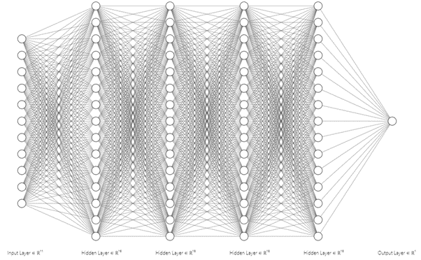
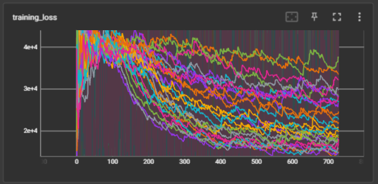
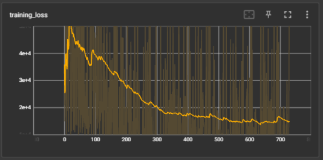
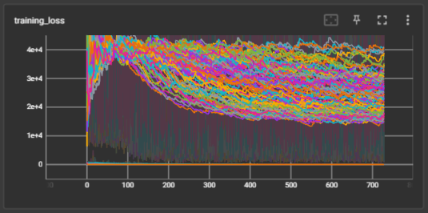
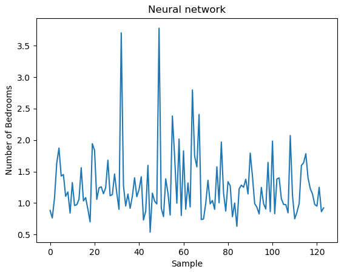
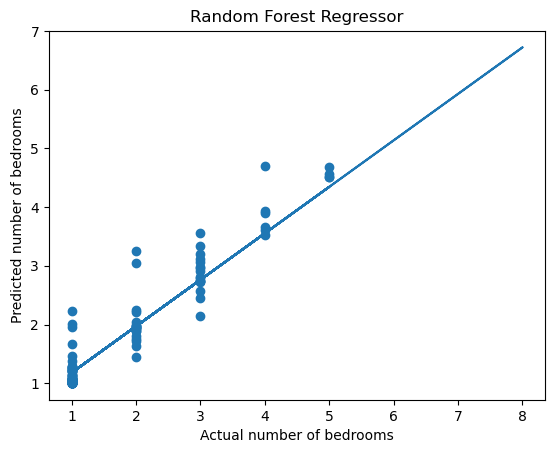

# The Machine Learning Model Project
Datasets are crucial tools for training machine learning (ML) models. Allowing them to learn and therefore predict future outcomes based on trends and patterns that are identified in the original dataset. 

This project will focus on using [AirBnB's](https://www.airbnb.co.uk/) property listing dataset to train an ML model that can predict the price per night for future listings. 

## Milestone 1
- The dataset (*AirBnBData.csv*) consists of 829 property listings and a variety of characteristics for each property. 
- The characteristics are a mixture of text and numerical values.
    - E.g., location, description, bedrooms, guests, ratings, price per night etc
- The first task was to clean the dataset with the following steps:
    - Remove rows with missing ratings.
    - Combine description strings into singular string and remove whitespaces.
    - Apply default feature values (1) for guests, beds, bathrooms and bedrooms if missing values.
```Python
def remove_rows_with_missing_data():
     df.dropna(subset=['Description', 'Cleanliness_rating', 'Accuracy_rating', 'Communication_rating', 'Location_rating', 'Check-in_rating', 'Value_rating'], inplace=True)

def combine_description_strings():    
    df['Description'] = df['Description'].str.replace('About this space', '')
    df['Description'] = df['Description'].apply(lambda x: [item for item in eval(x) if item != ''])
    df['Description'] = df['Description'].apply(lambda x: ''.join(x))

def set_default_feature_values():
    df.update(df[['guests', 'bedrooms', 'beds', 'bathrooms']].fillna(1))
```
- Alongside the dataset, there are images corresponding to each property listing.
- These were uploaded to an [AWS](https://aws.amazon.com/) S3 bucket and subsequently downloaded and cleaned.
    - Discarded any non-rgb images.
    - Resized them all to the same height of the smallest image whilst maintaining aspect ratio.
```Python
def resize_images():
    base_dir = r'C:\Users\lcox1\Documents\VSCode\AiCore\Data science\images'

    rgb_file_paths = []

    for subdir in os.listdir(base_dir):
        subdir_path = os.path.join(base_dir, subdir)
        if os.path.isdir(subdir_path):
            for f in os.listdir(subdir_path):
                file_path = os.path.join(subdir_path, f)
                if os.path.isfile(file_path):
                    with Image.open(file_path) as img:
                        if img.mode == 'RGB':
                            rgb_file_paths.append(file_path)
    
    min_height = float('inf')
    for checked_file in rgb_file_paths:
        with Image.open(checked_file) as im:
            min_height = min(min_height, im.height)

    for file_path in rgb_file_paths:
        with Image.open(file_path) as im:
            width, height = im.size
            new_height = min_height
            new_width = int(width * new_height / height)

            resized_im = im.resize((new_width, new_height))

            resized_im.save(os.path.join('processed_images', os.path.basename(file_path)))
```
## Milestone 2
- With the data now cleaned, the next step was to begin building the ML model.
- Firstly, the features and labels were chosen (price per night is the target).
    - Only numerical columns were used as features.
```Python
def load_airbnb(label):
    df = pd.read_csv('tabular_data/clean_tabular_data.csv')
    df.drop(columns=['ID', 'Category', 'Title', 'Description', 'Amenities', 'Location', 'url'])
    features = df.drop('Price_Night', axis=1).values
    labels = df.pop('Price_Night').values
    return features, labels

features, labels = load_airbnb('Price_Night')
```
- A baseline regression model was created in the *modelling.py* file with [Scikit-learn's](https://scikit-learn.org/stable/index.html) built-in regression model class [SGDRegressor](https://scikit-learn.org/stable/modules/generated/sklearn.linear_model.SGDRegressor.html). 
- This provided R2 and RMSE metrics for the validation and test sets that could be used to compare more advanced to.
- Prior to passing in the data, the features were normalized using the *StandardScalar* function from Scikit-learn.

## Milestone 3
- Another 3 regression models from Scikit-learn were used to find the most accurate one.
    - [Random Forest Regressor](https://scikit-learn.org/stable/modules/generated/sklearn.ensemble.RandomForestRegressor.html)
    - [Decision Tree Regressor](https://scikit-learn.org/stable/modules/generated/sklearn.tree.DecisionTreeRegressor.html)
    - [Gradient Boosting Regressor](https://scikit-learn.org/stable/modules/generated/sklearn.ensemble.GradientBoostingRegressor.html)
- The next step was to tune the hyperparameters for each of the 4 models; an important step in building ML models that helps to ensure greater accuracy and reducing over/underfitting of the data, amongst other benefits.
- For these models, a grid search was used to tune find the best hyperparameters based on the R2 and RMSE score.
```Python
grid_search = GridSearchCV(estimator=model, param_grid=parameter_grid, scoring=['r2', 'neg_root_mean_squared_error'], refit='neg_root_mean_squared_error', cv=5)
    grid_search.fit(X_train_scaled, y_train)
    best_model = models[model_class](**grid_search.best_params_)
```
- After the optimal hyperparameters had been determined for each model, they were all saved in json files alongisde the performance metrics.
- Another function was then used to return the best model from the 4 available; in this instance it was the Random Forest Regressor model.

## Milestone 4
- The next model to be trained was a classification model, with the label being the *'Category'* column in the dataset. 
- As with the previous regression model, a baseline model was created and hyperparameters selected with a grid search.
- However, the scoring metrics differ for classification models.
    - Accuracy and F1 scores for the validation set were used to determine the most effective model.
```Python
def find_best_model(models_directory):
    best_model = None
    best_acc = -float('inf')
    best_f1 = float('inf')

    for model_name in os.listdir(models_directory):
        metrics_path = os.path.join(models_directory, model_name, 'metrics.json')
        with open(metrics_path) as f:
            metrics = json.load(f)
            val_acc = metrics['validation_acc'] 
            val_f1 = metrics['validation_f1']

            if val_acc > best_acc and val_f1 > best_f1:
                best_model = model_name
                best_acc = val_acc
                best_f1 = val_f1
```
- To prevent overfitting, the features for this model were normalized with *StandardScalar* function from Scikit-learn. 
- Cross-validation was also used to help improve the performance of the models.

## Milestone 5
- The final type of model that was created in this project was a neural network. 
- [PyTorch](https://pytorch.org/) was used to create the architecture of the neural network. 
- In order to imrpove it's performance and rpevent overfitting, a regularisation method was used, known as dropout.
    - The aim including this was to reduce the complexity of the model and make it better suited to unseen data. 
```Python 
class NN(nn.Module):

    def __init__(self, config):
        super().__init__()
        # get values for width & depth from the config
        width = config['hidden_layer_width']
        depth = config['depth']
        dropout_prob = config.get('dropout_prob', 0)

        # define the layers
        layers = [torch.nn.Linear(11, width), torch.nn.ReLU()]
        for hidden_layer in range(depth - 1):
            layers.extend([torch.nn.Dropout(dropout_prob), torch.nn.Linear(width, width), torch.nn.ReLU()]) # add dropout layer
        layers.extend([torch.nn.Linear(width, 1)])
        self.layers = torch.nn.Sequential(*layers)

    def forward(self, X):
        return self.layers(X)
```
- A diagram of the neural network is shown below.




- Having built the architechture of the neural network and the relevant training loops that can be seen in *neuralnet.py*, the [Tensorboard](https://www.tensorflow.org/tensorboard) visualisation toolkit was used to view how the losses of the model changed as it was trained.
- The 1st image below displays the training loss for all of thhe models. 
- The 2nd image displays the best parameterised neural network. 




- The neural network was by far the most accurate model of the regression models built in this project, as detailed in the metrics inside the *best_model* inside *neural_networks*.
- This may be due to the model being able to better capture the relationship between the many features and single label, whereas the linear regression models may have struggled slightly. 

## Milestone 6
- The final part of this project was to apply the previously built models to a new use-case with regards to the AirBnB dataset (*clean_tabular_data.csv*).
- The chosen target for this was the variable 'bedrooms'.
- Another difference was the inclusion of 'category' as a numerical feature. 
- Since this column existed as a string for each sample, the values needed to be encoded and the dataframe then concatanated onto the existing features dataframe. 
- As you can see below, the features dataset, for the neural network in this case, is a combination of the two dataframes (*reuse_nn.py*).
```Python 
class AirbnbBedroomDataset(Dataset):
    def __init__(self):
        self.data = pd.read_csv('tabular_data/clean_tabular_data.csv')
        numerical_data = load_airbnb(self.data, 'bedrooms')
        category_column = self.data['Category']
        category_data = category_column.unique()
        encoder = LabelEncoder()
        category_encoded = encoder.fit_transform(category_column)

        numerical_data = numerical_data[0]
        numerical_df = pd.DataFrame(data=numerical_data, columns=['bedrooms_' + str(i) for i in range(numerical_data.shape[1])])
        category_df = pd.DataFrame(data=category_encoded, columns=['Category_Encoded'])
      
        self.features = pd.concat([numerical_df, category_df], axis=1)
        self.label = self.data['bedrooms']

    def __getitem__(self, idx):
        return (torch.tensor(self.features.iloc[idx].values), self.label[idx])

    def __len__(self):
        return len(self.features)
```
- A similar loss curve to those shown previously can be seen in the image below. 
- This indicates the neural network was able to suitably and accurately predict a different label.
- The metrics for the best model neural network (*neural_networks/regression_bedrooms/best_model*) were also very similar to those seen earlier. 



- Using matplotlib we can see the predicted values using the neural network are what would be expected.
- This is also backed up by the very strong R2 and RMSE scores in the performance metrics file for the best model.


- This reuse case was also applied to the linear regresison model that was built in Milestone 3. 
- The inclusion of the encoded column 'Category' as a feature was also applied. 
- A scatter graph displaying the predicted results and the actual results shows a strong correlation between the two.
- Again, the best linear regression model for this problem was determined to be the Random Forest Regressor, just as in the previous linear regression instance that predicted the price per night. 

 